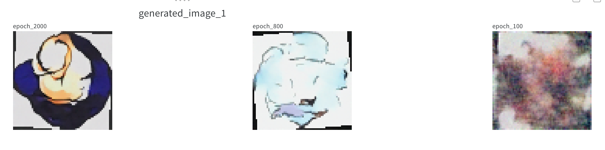
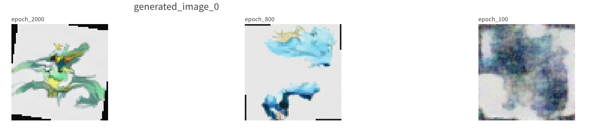
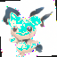
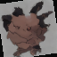
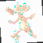
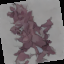
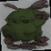
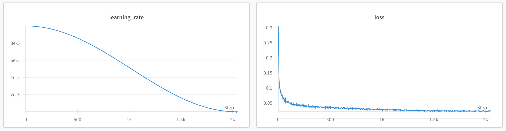

# 从零开始实现 DDPM

这里是我在视频中讲解的代码，主要是关于Diffusion模型的实现。

使用了一个800张照片的pokemon的小规模图片数据集，演示从零开始的训练过程。

由于是从零训练并没有依赖任何预训练的模型，展示了 Diffusion + Spatial Transformer + Attention + Unet （这些模块合在一起就是比较现代的DDPM模型了），模型只作为教学示例。

下一个视频我再来用 VAE + DDPM 来实现一个接近 Stable Diffusion 2 的模型架构。

在本地 Mac M3 上训练大概需要16G内存，大概需要2～4小时。如果要达到更好的效果，则需使用更大的数据集和算力。

#### 需要安装的库：
```
numpy
torch
torchvision
Pillow
datasets
transformers
PIL
tdqm
datasets
```

#### 训练图片数据集：

运行`train_diffusion.py`会从huggingface上下载一个[pokemon](https://huggingface.co/datasets/svjack/pokemon-blip-captions-en-zh)的小规模图片数据集。

当然，你也可以在代码中替换成本地的其他图片数据集。

#### 训练Epoch过程中的样本图片生成：

随着训练epoch过程，生成（带文字条件）的图片会越来越清晰。

> `文本条件 = "a water type pokemon"`



> `文本条件 = "a dragon character with tail"`



#### 训练完成后模型生成：

模型训练完成后，运行 `sample_diffusion.py` 可以生成一些图片。

> 1. `文本条件 = "a cartoon pikachu with big eyes and big ears"`
- 普通DDPM采样生成：



- Classifier-Free Guidance(CFG) 采样：



> 2. `文本条件 = "a red pokemon with a red fire tail"`

- 普通DDPM采样生成：



- Classifier-Free Guidance(CFG) 采样生成：



> 3. `文本条件 = "a green bird with a red tail and a black nose"`

- 普通DDPM采样生成：


- Classifier-Free Guidance(CFG) 采样生成：

所有的CFG采样生成的图片都比较暗是由于对数据集进行了数据增强处理，导致了图片的亮度变化。而在训练过程中，模型学习到了这种亮度变化，所以生成的图片也会有这种特点。




#### 关于损失值：

使用了均方误差损失函数。

训练图片被缩放成了64x64的尺寸，所以损失值是按照像素计算的。

由于这个例子中的pokemon数据集相对较小，300个epoch和2000个epoch的结果差不多。要想达到更完美的生成效果，个人能力认为智能增加更多pokemon训练集图片数量。因为加入文本嵌入条件之后做到生成的泛化，800张图片是远远不够的（参考SD2的训练集数量是1亿张以上）。

- Learning rate 及 训练损失：



#### 效果说明：

Diffusion这里想说的东西太多了，基本都在视频里讲了一遍。

由于这个实现是增加了“文本条件”的，所以简单的模型架构和少量的训练集无法达到很好的泛化效果。

- 如果只是使用DDPM模型来实现训练集上见过的图片浮现是很容易的；

- 又或者做照片分类任务DDPM也较容易。

但以上这两方面网上开源的实现已经很多了。

加入文本条件的生成模型则教学很少。在代码的实现中增加了Attention机制，跳跃链接等，这样才能更好的利用文本信息以结合图片像素关系。

这个实现只是一个简单的示例，希望能给大家一些启发。