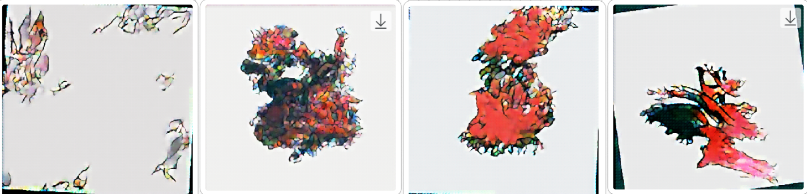
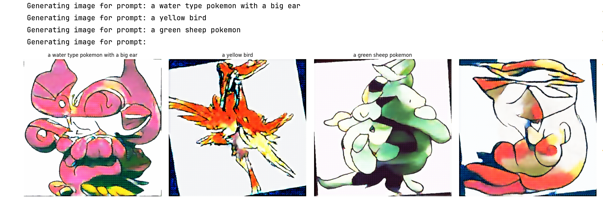
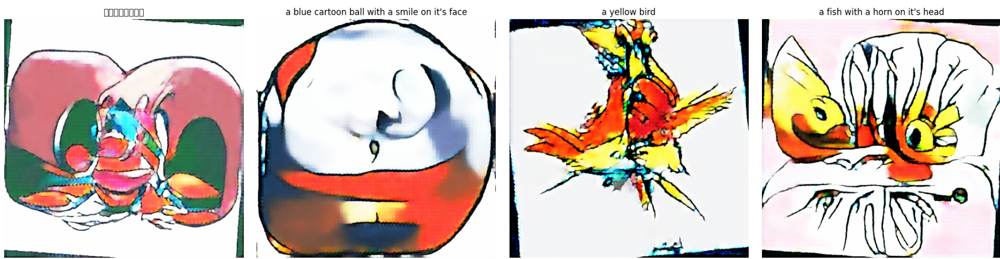
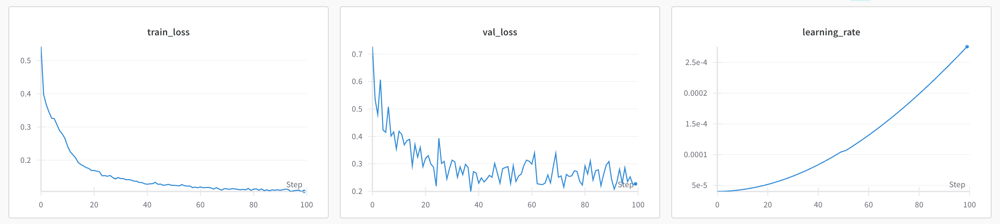

# 从零开始实现 Stable Diffusion 模型

> 与 `vae_from_scratch`和`diffusion_from_scratch` 两文件夹下的训练不同，这次的`stable_diffusion_from_scratch`是在 A100 GPU上训练，大概需要30G内存。

这个目录是我在视频中讲解的从零复现 Stable Diffusion 模型结构的代码。使用了一个800张照片的 [pokemon](https://huggingface.co/datasets/svjack/pokemon-blip-captions-en-zh) 的小规模图片数据集。其中600张用作训练（通过数据增强）、200张用作验证。

由于是从零训练并没有依赖任何预训练的模型，数据集也较小，效果不用在乎，只需关注实现原理并作为教学示例。

教学视频是循序渐进的，这个文件夹下的代码内容已经整合包含了 `vae_from_scratch/` 和 `ddpm_from_scratch/` 两部分文件夹下的内容，实现了一个完整的SD2.x模型架构：

- 通过VAE将原始图片（3通道彩色 x 512高 x 512宽）压缩成潜在空间表示 (Latent dimension：4 x 64 x 64）；
- 将潜在空间表示（ 4 x 64 x 64 ）传递给 DDPM 架构进行噪声预测的训练；
- 训练完成的 DDPM 模型可生成带有文字条件的潜在空间表示；
- 通过VAE将潜在空间表示解码恢复成像素空间图片。

训练大概需要2～4小时。如果要达到更好的效果，则需使用更大的数据集和算力。

#### 需要安装的库：
```
numpy
torch
torchvision
Pillow
datasets
transformers
PIL
tdqm
datasets
```

#### 训练图片数据集：

运行`train_stable_diffusion.py`会从huggingface上下载一个[pokemon](https://huggingface.co/datasets/svjack/pokemon-blip-captions-en-zh)的小规模图片数据集。

当然，你也可以在代码中替换成本地的其他图片数据集。

#### 训练Epoch过程中的样本图片生成：

随着训练epoch过程，通过潜在空间生成（带文字条件）的512x512图片会越来越清晰。

> `文本条件 = "a dragon character with tail"`
> 
> `epoch 1, 30, 60, 90,` 生成的图片如下（可以看到学习的过程）：



#### 训练完成后模型生成：

模型训练完成后，运行 `sample_stable_diffusion.ipynb` 可以生成一些图片。

> 1. `文本条件`
> - "a water type pokemon with a big ear",
> - "a yellow bird",
> - "a green sheep pokemon",
> - "" （无文本条件）



> 2. `文本条件`
> - "一只大耳朵的小鸟",
> - "a blue cartoon ball with a smile on it's face",
> - "a yellow bird",
> - "a fish with a horn on it's head"




#### 关于损失值：

计算潜在空间的均方误差损失、多样性损失、一致性损失来协调总损失。

训练图片首先被我们之前视频里的预训练VAE模型（`var_from_scratch`文件夹下）压缩放成了4x64x64的潜在空间表示。再在潜在空间训练噪声预测。并通过VAE重构成3x512x512像素空间的图片。

由于这个例子中的pokemon数据集相对较小，模型的泛化能力较差。要想达到更完美的生成效果，个人能力认为智能增加更多pokemon训练集图片数量。因为加入文本嵌入条件之后做到生成的泛化，800张图片是远远不够的（参考SD2的训练集数量是1亿张以上）。

- Learning rate 及 训练损失：

- 


#### 效果说明：

由于这个实现是增加了“文本条件”的，所以简单的模型架构和少量的训练集无法达到很好的泛化效果。

如果要复现Stable Diffusion 2.x的效果，必然需要更大的数据集和更多的训练时间。这个实现只是一个简单的示例，希望能给大家一些启发。


#### 待改进：

其实还可以提高效果的地方有很多，比如：

- 学习率调整策略（我的学习率随着整体epoch数先上升后下降的，但由于我前期看到已经产生了效果就提前停止了）；
- 损失函数的权重调整；
- 更多的数据增强策略；