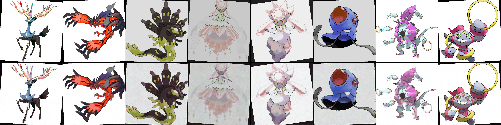
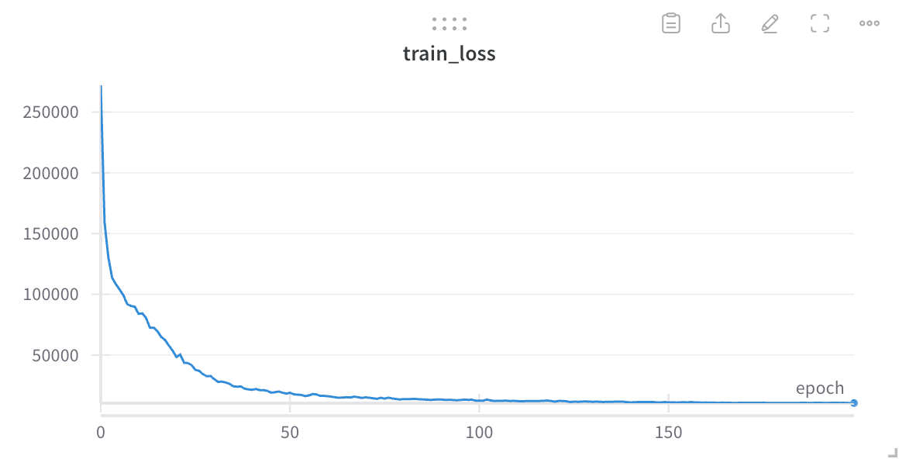
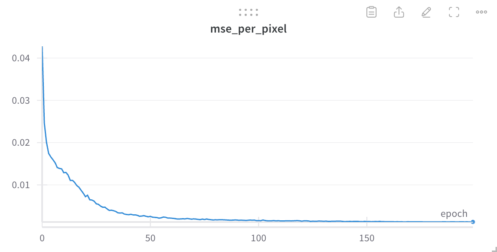
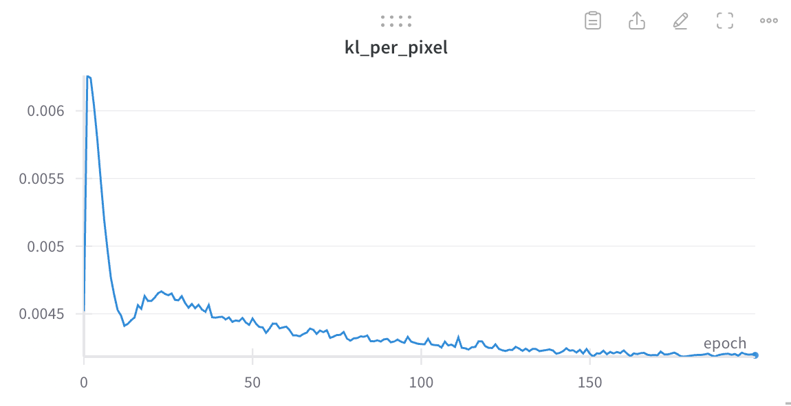
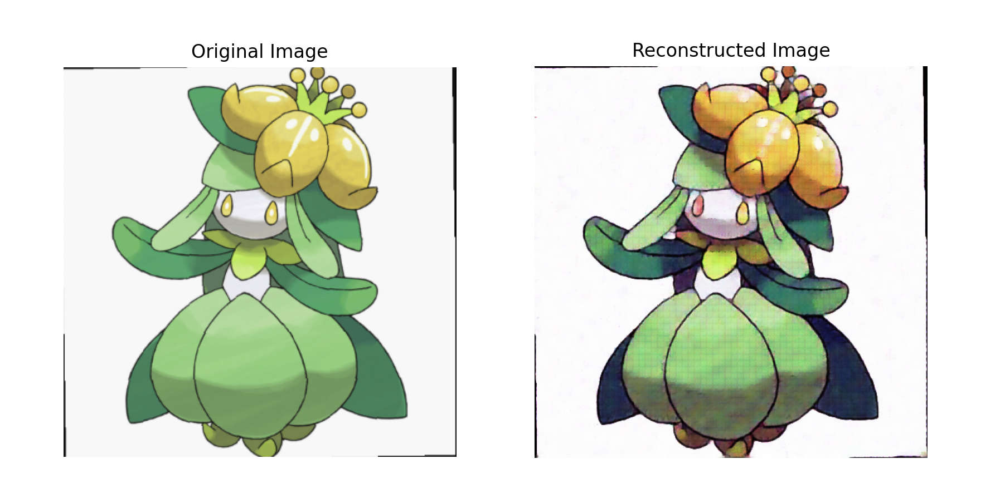
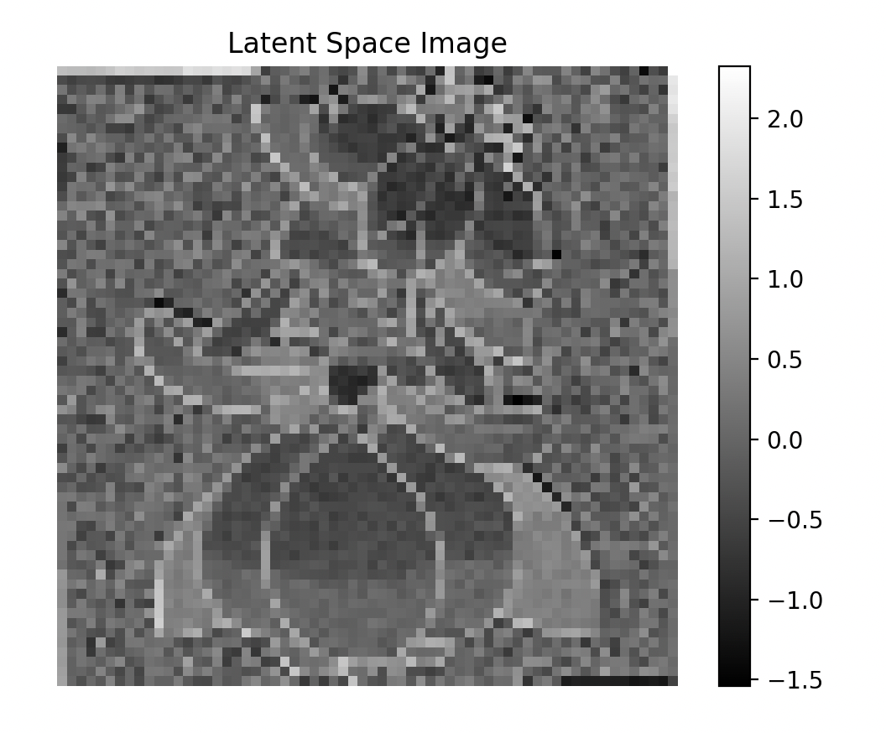

# 从零开始实现VAE

这里是我在视频中讲解的代码，主要是关于VAE的实现。

使用了一个pokemon的小规模图片数据集，演示训练过程。

#### 需要安装的库：
```
numpy
torch
torchvision
Pillow
datasets
matplotlib
```

#### 训练图片数据集：

运行`train_vae.py`会从huggingface上下载一个[pokemon](https://huggingface.co/datasets/svjack/pokemon-blip-captions-en-zh)的小规模图片数据集，然后训练VAE模型。

当然，你也可以在代码中替换成本地的其他图片数据集。

#### 训练过程中的重构图片：

训练过程中将原始图片压缩到潜在空间，然后再从潜在空间解码还原成像素空间图片。

Epoch 0:


Epoch 20:


Epoch 40:


Epoch 100:


#### 关于损失值：

VAE的损失值是由两部分组成的，分别是重构损失和KL散度损失。两个损失的比重可以自定义。

由于这个例子中的pokemon数据集相对较小，100到200个epoch的结果差不多。要想达到更好的效果，可以增加训练集图片数量，或者减小图片尺寸。

- 训练总损失：


- MSE损失（像素）：


- KL散度损失（像素）：



#### 调用sample_vae.py尝试用训练好的VAE模型来压缩并恢复一张图片：



#### 潜在空间的可视化：

将潜在空间的向量可视化，可以看到潜在空间的分布情况：

